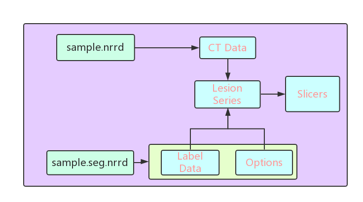
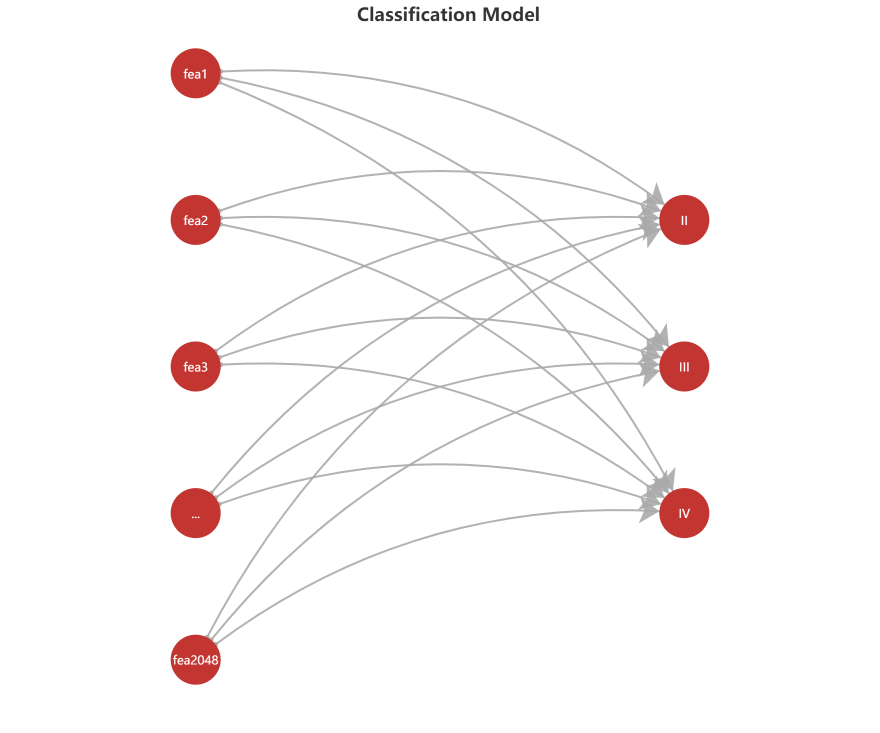

### CNN卷积神经网络迁移学习实例

对特定肿瘤影像数据进行等级分类预测

---

摘要：本文介绍基于Inception-v3的迁移学习方法应用，并用该方法对一批特定的数据进行训练。

作者：yooongchun

微信：18217235290

------

#### 1.数据介绍

##### 1.1数据下载

数据来源于TCIA网站上的胶质瘤数据：http://www.cancerimagingarchive.net/

##### 1.2 数据介绍

该数据集一共122个样本。数据包含两个部分，其一是医学CT扫描影像数据，以nrrd格式提供，其二是医生诊断的临床数据，以csv格式提供；其中医学CT扫描影像数据又包含两个部分，分别是原始的病人CT扫描数据和医生勾画的病灶数据；一个完整的样本构成为：病人CT扫描数据+医生标记病灶数据+临床病理等级标签；综合以上描述，给出数据集的结构示意如下：

#### 2.数据预处理

数据预处理旨在为之后的特征提取提供标准化数据。其步骤包括：样本筛选、切片抽取、切片筛选、切片分类及切片统一大小。

##### 2.1样本筛选

第一个步骤是样本筛选。样本筛选是结合临床诊断数据进行的，通过观察临床诊断数据，发现其中只有80个样本是存在病理等级数据的，并且，存在病理等级数据的这些样本只包含于三个病理等级中（分别为II、III和IV），每个样本唯一对应一个病理等级，这样第一步的样本筛选可定义为：

**按照样本id的病理等级数据提取数据**

其示意图如下：

经过以上筛选，获得的结果是每个病理等级下相应病理等级的病人数据，三个病理等级数据一共80个样本，其中等级II包含病人样本34个，等级III包含病人样本24个，等级IV包含病人样本22个，如表一所示。

| 病理等级 | 样本数量 |
| -------- | -------- |
| II       | 34       |
| III      | 24       |
| IV       | 22       |

这些样本将作为切片提取的基础。

##### 2.2切片提取

首先，需要介绍一下这里**切片** 的定义：上述2.1过程筛选出来的样本每个样本都是以nrrd格式保存的文件，并且每个样本包含两个nrrd文件，分别为CT扫描数据和医生勾画的病灶数据，每个样本会包含很多张图像数据（我们的样本中约为50到200的数量），每张图像数据就是一个CT扫描层，我们称之为**切片**。 对单个样本构成的形象示意如下图：

现在我们来讨论数据的切片提取。这里使用Python提供的nrrd模块作为基础，该模块可提供nrrd文件的读写功能，使用该模块读取一个样本文件，注意到一个样本的构成如下：

这样经过CT Data和Label Data的配准操作就把切片数据提取出来了。提取出来的切片数据仍然按照病理等级分为II、III、IV三个类别，其中，病理等级II包含切片2583张，病理等级III包含切片1613张，病例等级IV包含切片1514张，如表二所示。

| 病理等级 | 切片数量 |
| -------- | -------- |
| II       | 2583     |
| III      | 1613     |
| IV       | 1514     |

##### 2.3 切片筛选

对于一个样本而言，切片包含了病灶区和非病灶区两种，而对最终的按照病理等级进行分类的目的而言，只有样本中包含病灶的切片才是有意义的，因而切片筛选的第一步即是进行病灶切片和非病灶切片的筛选，这个步骤需结合切片提取过程中的Options信息，在sample.seg.nrrd文件的options中存在病灶区域的切片起始终止序号，因而结合该信息进行筛选，筛选后病理等级II还有704张切片，病理等级III还有385张切片，病理等级IV还有419张切片，如表三所示。

| 病理等级 | 病灶切片数 |
| -------- | ---------- |
| II       | 704        |
| III      | 385        |
| IV       | 419        |

完成上述的筛选后，观察发现存在切片病灶区域非常小的情况，这样的病灶切片跟无病灶切片在分类意义上无明显区别，故而需要剔除，剔除以病灶区的面积为指标，对每个样本，对病灶切片按照病灶区面积大小进行从大到小排序，然后保留面积较大的病灶切片而剔除面积较小的病灶切片，需要指出的一点是每个样本中病灶面积大小是不一样的，因而不能以排序后按照排序排名来剔除切片，一个通俗易懂的例子是对病灶切片排序后A样本的第50张切片病灶区面积为500个像素大小，而B样本的第50张切片病灶区域面积只有10像素大小，一个更加合理的剔除规则是按照切片面积，然而还需要考虑到的一个因素是：应该保留每个样本的适量切片，这样才能保证样本数据被充分利用，这样完整的筛选规则被定义为：

1. 对每个样本按照病灶切片病灶区域面积大小进行排序
2. 对样本i以面积阈值Ti进行筛选，面积大于Ti的保留，小于Ti的剔除。Ti是一个实验值，不同样本取值不同，但需满足这样两个准则：
   - 大于Ti阈值的切片病灶区域明显可见
   - 样本Ti在被阈值Ti筛选后不能剔除所有病灶切片

经过以上筛选，获得最后的样本病灶切片数量为：病理等级II一共600张切片，病理等级III一共338张切片，病理等级IV一共270张切片，如表四所示。

| 病理等级 | 病灶切片数 |
| -------- | ---------- |
| II       | 600        |
| III      | 338        |
| IV       | 270        |

##### 2.4 切片大小统一

以上步骤完成了切片的筛选，接下来需要进行的就是分类训练了，在分类训练前，还需要一个准备步骤就是切片的大小统一化，由于不同样本的病灶区大小是不一样的，因而前面的步骤获得的切片大小也是不一致的，在分类中，为了使每张切片进行卷积运算，需要输入统一格式统一大小统一通道数的数据，考虑到后面的模型使用Inception-v3模型进行迁移学习，而该模型接受的输入为3通道（RGB）299*299大小的数据，因而统一把所有病灶切片缩放为299\*299\*3，考虑到病灶切片数据为CT扫描的影像数据，数据范围为0到1024，且其病灶区的数据密度大和变化快，因而采用三次样条插值法进行图像缩放。

综合以上筛选过程，给出每次筛选的样本/切片数量示意表格如表五。

| 筛选类型     | II类样本数 | III类样本数 | IV类样本数 | 样本总计 | II类切片数 | III类切片数 | IV类切片数 | 切片总计 |
| ------------ | ---------- | ----------- | ---------- | -------- | ---------- | ----------- | ---------- | -------- |
| 样本筛选     | 34         | 24          | 22         | 80       | 2583       | 1613        | 1514       | 5710     |
| 病灶切片筛选 | 34         | 24          | 22         | 80       | 704        | 385         | 419        | 1508     |
| 切片面积筛选 | 34         | 24          | 22         | 80       | 600        | 338         | 270        | 1208     |

#### 3.构建分类器

##### 3.1 选择依据

上述步骤获得了规范统一的数据切片及其病理等级，接下来就是按照病理等级对数据样本进行分类，参考前人的研究，多是用`Pyradiomics` 库来提取特征，接下来使用分类器来进行分类训练，分类器的选择上如svm分类、random forest分类等，分类器给出的结果虽然有差异，但基本都相近，且分类的正确率很多都未到90%及以上，如此来看，提升分类正确率的瓶颈已不在分类器的选择上，而在于特征提取上。

为了说明分类正确率的瓶颈在特征提取上，需要先对`Pyradiomics` 特征提取进行基本说明。`Pyradiomics`是一个`Python` 的特征提取开发包，其官网地址：https://pyradiomics.readthedocs.io/en/latest/，其可提取的特征包含以下五个类别：

-        First Order Statistics features

-        Shape-based features

-        Gray Level Cooccurence Matrix (GLCM)

-        Gray Level Run Length Matrix (GLRLM)

-        Gray Level Size Zone Matrix (GLSZM)

这些特征都是基于样本数据经过计算得来的，存在明显的物理意义，比如一阶特征、形状特征等，而使用这些特征进行分类训练最终结果不如人意也说明这样一个问题：**对于带有明显物理意义的特征对刻画病理等级能力有限** ，这样一种新的思路自然是寻求不同的方式来提取新的特征，并且这种新的特征应该包含但不限于带有物理意义的特征；考虑到目前卷积神经网络在图像处理领域表现出来的优势及其对特征刻画的优秀表现，我们的目光就聚焦到了卷积神经网络上。

选择卷积神经网络也面临着难题，首先任何一种卷积神经网络都需要大量的样本输入，而大量样本输入则对应着非常高的计算资源需求，而结合本文的数据集才有80个样本这样的事实，选择一种少量数据集下表现优秀的卷积神经网络就成了关键点。

目前业界针对小数据集进行卷积神经网络训练提出的主流方式是迁移学习（transfer learning）。该方法的思想是使用大数据集进行模型训练，然后使用训练好的参数对小样本进行参数微调，这样使得最终训练出来的模型具有小数据集和高精度的双重优势，由此可见本文数据集上理想的解决方案即是：迁移学习+参数微调。

迁移学习目前网络上提供的模型较多，综合考虑模型参数量、模型表现、模型可得性、模型训练计算资源需求量、模型易用性等因素，本文选择了Google开源的Inception-v3模型作为迁移学习的框架，该框架在ImageNet数据集上进行训练，该数据集有着1000个类别超过100万张的图片数据，该模型在ImageNet数据集上获得了优秀的表现。

##### 3.2 模型构建

选择了Inception-v3模型后，本文的做法是将该模型瓶颈层的输出作为提取的特征，然后把这些特征经过一个全连接层进行分类，Inception-v3模型示意图如下：

在上图中最右边示意的`Bottleneck feature` 位置即是特征输出的位置，也就是说该模型的最后三层被丢弃，然后瓶颈层的结果作为本文新模型的特征提取结果，该结果是2048长度的特征向量。

获得该特征向量之后，需要将其输入一个全连接层进行分类，全连接层的模型示意图如下：

将以上两个模型连接到一起就构成了完整的模型，模型的输入是不同病理等级的切片图，而输出就是对切片的病理等级判断。

#### 4.模型训练

训练过程不仅耗费计算资源，并且需要花费较多时间，为了合理利用计算资源、节约时间成本及有效提高模型训练效果，因而需要合理设计模型结构，主要包括这样几点：

- 缓存模型计算结果，加快计算过程
- 图像以一定数量批量输入，加快计算且充分利用计算资源
- 设置合理的训练参数以提高模型训练结果及减少训练次数

以下具体来讨论如何实现这些步骤及最终结果

##### 4.1模型参数

模型参数主要包括以下几个：验证集合测试集百分比、学习率、一次输入图片数量及训练次数。

- 验证集测试集百分比：验证集用于在训练过程中实时测试模型的训练效果，而测试集则用于在最后测试模型的正确率。本文中每个类别的图像数量在300到500数量级，考虑到验证集和测试集需要能测试模型的效果，因而数据量不可太少，同时为了有效利用数据进行训练，则也不能划分太多数据出去，故而综合衡量之后选择以数据的10%作为验证集和测试集。

- 训练次数：训练次数即对模型进行多少次的训练，训练次数太少分类效果差，但是训练次数太多则会导致浪费时间，在本文中，先使用一个较小的数据量进行试训练，经过观察发现10000次的训练次数基本能让模型达到训练稳定，故而综合考虑后选择10000次作为训练次数。

- 学习率：学习率是在训练过程中对权重进行调整的一个比例因子，太大的学习率会导致模型波动不能收敛，甚至无法收敛，而太小的学习率则让模型收敛过慢，浪费训练时间和计算资源，在本文中，先使用一个较大的学习率（0.1）进行测试，然后不断减小，最终选用了一种指数下降的学习率，其衰减公式为：

  $$LR=BLR*e^{-\frac{i*ln(0.1/MLR)}{STEPS}}$$

  上式中，LR（Learning Rate）代表学习率；BLR（Base Learning Rate）代表基础学习率，本文取0.1；MLR（Minimum Learning Rate）代表最小学习率，即学习率衰减的最低限度，本文取0.001；STEPS即是训练的次数，本文统一取为10000次，i是当前训练次数，从0开始到9999。上述学习率在训练过程中的变化如下：

  

#####4.2 训练过程

初始参数设定好之后开始训练，每次训练需要微调参数以得到更好的训练结果，经过多次尝试，最终设定参数为：

- 学习率：指数衰减学习率，初始0.1，衰减极限0.001；
- 训练次数：10000
- 每次输入的数据量：100
- 测试集占比：10%
- 验证集占比：10%

##### 4.3 结果分析

为了验证模型的鲁棒性，在上述最优参数下进行了10组测试，每组测试中随机打乱验证集与测试集，其测试结果如下：

上述图中，最粗的一条线代表最终测试集结果最好的一次训练，其正确率为：99.59%

10次训练的最终测试集正确率见表六。

| 训练次第 | 学习率     | 训练步长 | 测试集正确率       |
| -------- | ---------- | -------- | ------------------ |
| 第1次    | 0.1--0.001 | 10000    | 0.9520000219345093 |
| 第2次    | 0.1--0.001 | 10000    | 0.9327731132507324 |
| 第3次    | 0.1--0.001 | 10000    | 0.9612069129943848 |
| 第4次    | 0.1--0.001 | 10000    | 0.9551020264625549 |
| 第5次    | 0.1--0.001 | 10000    | 0.9414414167404175 |
| 第6次    | 0.1--0.001 | 10000    | 0.9737991094589233 |
| 第7次    | 0.1--0.001 | 10000    | 0.9762845635414124 |
| 第8次    | 0.1--0.001 | 10000    | 0.9427480697631836 |
| 第9次    | 0.1--0.001 | 10000    | 0.9795918464660645 |
| 第10次   | 0.1--0.001 | 10000    | 0.9958506226539612 |

将以上正确率通过图形画出，可直观看出其变化情况，如下图所示：

从图中可看到：10次训练中，最终的验证集正确率都高于93%，最高的一次为第10次，正确率为99.6%，平均正确率为96.0%，波动的样本方差为0.00039842787655466335，可见，模型的稳定性非常高，在打乱验证集与测试集的情况下训练的效果都比较好。

#### 5.总结

经过以上4个部分的谈论，本文的整个研究过程已经完整展示，最后，将简要给出本文的整体过程和模型的优劣势，并在此基础上提出模型的改进方向。

##### 5.1 流程总结与优势分析

总体来看，本文研究包含了这样三个主要步骤：

- 数据预处理
- 模型构建
- 模型训练

数据预处理主要解决的问题是样本与临床数据的匹配，使得每个样本符合这样的构成：CT扫描数据+临床标记病灶区域+病理等级。首先进行的样本筛选解决了CT扫描数据和病理等级的匹配，接下来的切片提取和切片筛选解决了临床标记病灶区域获取问题，最后的切片大小统一则是为了模型训练提供标准规范化输入。

模型构建主要解决的问题是构建一个高效的模型来实现数据特征提取和等级分类；本文首先阐述了现有基于`Pyradiomics` 提取特征的研究方法的弊端，`Pyradiomics`提取特征具有明显物理意义的特点使得其对深层特征刻画能力不足，因而结合卷积神经网络的优秀的图像特征刻画能力提出了使用卷积神经网络提取特征的思想，然后考虑到数据集的数量不足和计算资源有限的事实，结合迁移学习思想最终构建一个基于迁移学习的CNN网络。

最后经过不断地参数调优最终训练出了一个分类正确率在95%左右的模型，并且通过实验证明了模型具有很强的鲁棒性。

##### 5.2模型改进

本文的模型虽然具有较高的分类正确率，但是仍存在不足之处。首先，在进行数据预处理时，对切片进行筛选时，由于必须兼顾病理等级样本完整性和切片病灶，这样选择的病灶切片始终是具有不同标准的，对最后的结果自然也有影响，一个可行的改进方案是忽略样本差异，仅以切片病灶面积为差异指标，这样获得的切片会具有更好的可分类特征。其次，在最后的分类中，考虑到现有计算资源有限及时间有限，仅使用了一个全连接层进行分类，虽说这个分类器能够获得较高的分类正确率，但是如果可以使用不同的分类器来进行训练，那么可以验证什么分类器最合适，同时也能完善模型的完整性。最后，在进行模型在最优参数下的鲁棒性验证时仅使用了10次训练的结果作为对比分析，如果时间允许，完全可以再进行更多的训练来优化该过程。

##### 5.3 结论

综合以上分析，本文通过分析现有研究流程，找出了其性能瓶颈，然后结合卷积神经网络，提出新的特征提取方法，在已有研究流程的基础上，完善了研究方法，同时，也将本文的数据集分类正确率提高到最高99.6%的水平；其次，本文构建的模型是具有普适性的，可以稍加改进就应用于不同的数据集进行特征提取及分类。再次，本文在构建模型的过程中综合考虑了计算资源和时间成本，构建的卷积神经网络模型在普通的个人笔记本上即可进行训练，因而时间成本和计算资源成本都是非常便宜的，而这对于深度学习模型来说是至关重要的；综合以上几点来看，本文的研究具有现实可应用性，具有可推广性，因而具有较高的实用价值！